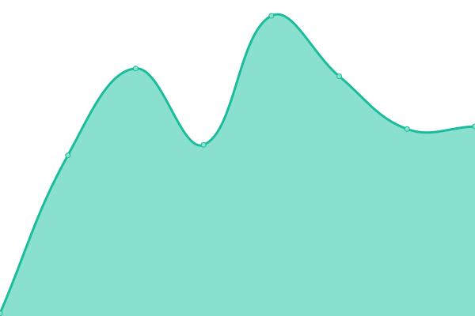
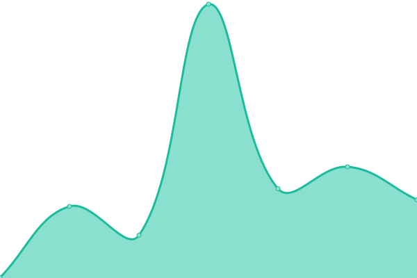
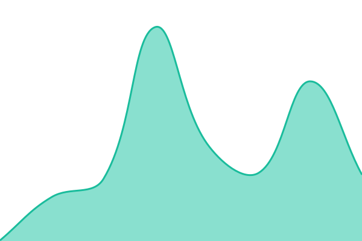
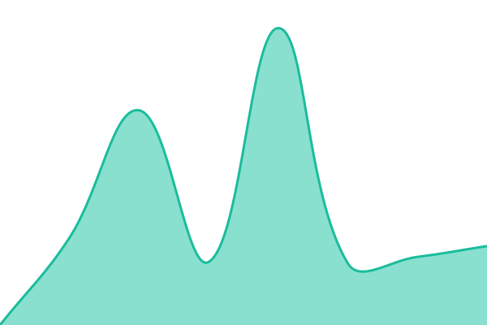
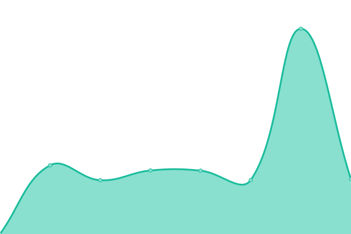
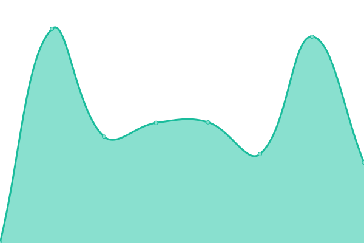

# [📈 Live Status](https://upptime.github.io/upptime): <!--live status--> **🟧 Partial outage**

This repository contains the open-source uptime monitor and status page for [Upptime](https://upptime.js.org), powered by [Upptime](https://github.com/upptime/upptime).

With [Upptime](https://upptime.js.org), you can get your own unlimited and free uptime monitor and status page, powered entirely by a GitHub repository. We use [Issues](https://github.com/upptime/upptime/issues) as incident reports, [Actions](https://github.com/Ezh494/upptime/actions) as uptime monitors, and [Pages](https://upptime.github.io/upptime) for the status page.

<!--start: status pages-->
<!-- This summary is generated by Upptime (https://github.com/upptime/upptime) -->
<!-- Do not edit this manually, your changes will be overwritten -->
<!-- prettier-ignore -->
| URL | Status | History | Response Time | Uptime |
| --- | ------ | ------- | ------------- | ------ |
|  [Google](https://www.google.com) | 🟩 Up | [google.yml](https://github.com/Ezh494/web-uptime/commits/HEAD/history/google.yml) | 

 79ms
     
 | 

<a href="https://ezh494.github.io/web-uptime/history/google">100.00%</a>
    

|  [Wikipedia](https://en.wikipedia.org) | 🟩 Up | [wikipedia.yml](https://github.com/Ezh494/web-uptime/commits/HEAD/history/wikipedia.yml) | 

 181ms
     
 | 

<a href="https://ezh494.github.io/web-uptime/history/wikipedia">100.00%</a>
    

|  [Hacker News](https://news.ycombinator.com) | 🟩 Up | [hacker-news.yml](https://github.com/Ezh494/web-uptime/commits/HEAD/history/hacker-news.yml) | 

 263ms
     
 | 

<a href="https://ezh494.github.io/web-uptime/history/hacker-news">100.00%</a>
    

|  [Test Broken Site](https://thissitedoesnotexist.koj.co) | 🟥 Down | [test-broken-site.yml](https://github.com/Ezh494/web-uptime/commits/HEAD/history/test-broken-site.yml) | 

 0ms
     
 | 

<a href="https://ezh494.github.io/web-uptime/history/test-broken-site">100.00%</a>
    

|  [Site MLG](https://mlg.ru) | 🟩 Up | [site-mlg.yml](https://github.com/Ezh494/web-uptime/commits/HEAD/history/site-mlg.yml) | 

 6737ms
     
 | 

<a href="https://ezh494.github.io/web-uptime/history/site-mlg">100.00%</a>
    

|  [Mail MLG](https://mail.mlg.ru) | 🟩 Up | [mail-mlg.yml](https://github.com/Ezh494/web-uptime/commits/HEAD/history/mail-mlg.yml) | 

 4895ms
     
 | 

<a href="https://ezh494.github.io/web-uptime/history/mail-mlg">100.00%</a>
    

|  [PR Medialogia](https://pr.mlg.ru) | 🟩 Up | [pr-medialogia.yml](https://github.com/Ezh494/web-uptime/commits/HEAD/history/pr-medialogia.yml) | 

 4858ms
     
 | 

<a href="https://ezh494.github.io/web-uptime/history/pr-medialogia">100.00%</a>
    

|  [SM Medialogia](https://sm.mlg.ru) | 🟩 Up | [sm-medialogia.yml](https://github.com/Ezh494/web-uptime/commits/HEAD/history/sm-medialogia.yml) | 

 2610ms
     
 | 

<a href="https://ezh494.github.io/web-uptime/history/sm-medialogia">100.00%</a>
    

|  [IM Medialogia](https://im.mlg.ru) | 🟩 Up | [im-medialogia.yml](https://github.com/Ezh494/web-uptime/commits/HEAD/history/im-medialogia.yml) | 

 755ms
     
 | 

<a href="https://ezh494.github.io/web-uptime/history/im-medialogia">100.00%</a>
    

<!--end: status pages-->

[**Visit our status website →**](https://upptime.github.io/upptime)

## 📄 License

- Powered by: [Upptime](https://github.com/upptime/upptime)
- Code: [MIT](./LICENSE) © [Upptime](https://upptime.js.org)
- Data in the `./history` directory: [Open Database License](https://opendatacommons.org/licenses/odbl/1-0/)
